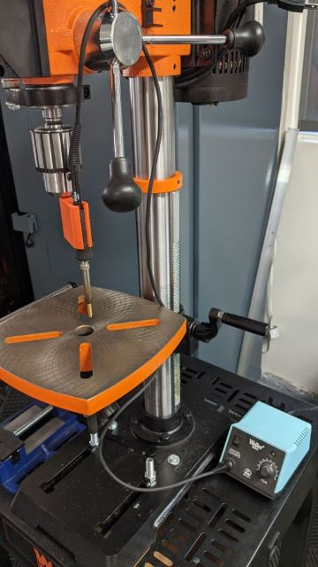
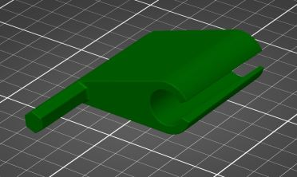

Heat Insert Press Holder
==================

## Overview
When using a soldering iron to install brass heat inserts on plastic printed parts, I often want to be sure they are square to the surface of the part. There are several existing designs for small presses, but I have a drill press already and part of its job is to be square to its work table, so I thought I would try and use that. 

The hexagon "drill bit" end was modeled to be about the same as as 3/8" drill bit. It is 9.5mm corner to corner. I modeled a hexagon rather than a circle with flats to make it easier to print and to give me more options for rotating the holder around. The soldering iron holder was designed to fit a Weller PES51 soldering pencil that came with my WES51 kit. It relies on compression of the thin pad on the iron to keep it in place. I wanted the iron to fit a little higher than it ended up, but I had trouble removing all the support material inside the round section so it is tighter than designed. It's closse enough so I'm going to use this for now.

## Printing
I used PETG with 0.2mm layer height with 15% gyroid infill and 3 perimeters. I printed this in on its side, letting PrusaSlic3r autogenerate supports. I think PLA might be too brittle to keep the iron in place but I didn't try it. ABS would probably work great.   

It prints easily without supports when standing on the bottom, but then the hexagon bit breaks easily because the layers pull apart. Printing on the flat spine of the hexagon bit with the round holder straight up in the air may give a better result, but this works so I'll stick with it until I find a problem.

