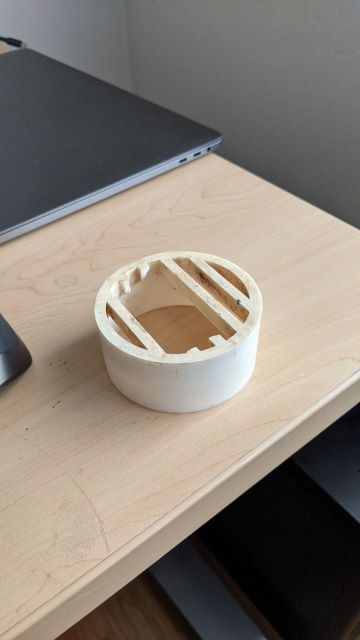
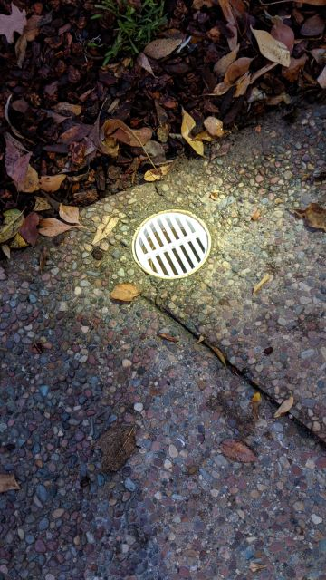

Outside Drain Covers
==================

## Overview
I have a few drains built into concrete for water runoff. They have old covers that have broken over time, and it seemed easy to replace them with printed parts. There are small and large drain holes, so large and small parts in the designs here. This wasn't the best fully parametric design, I have to manually adjust the slots in the cover when adjusting the diameter. I was trying get the covers printed and replaced quickly. 

