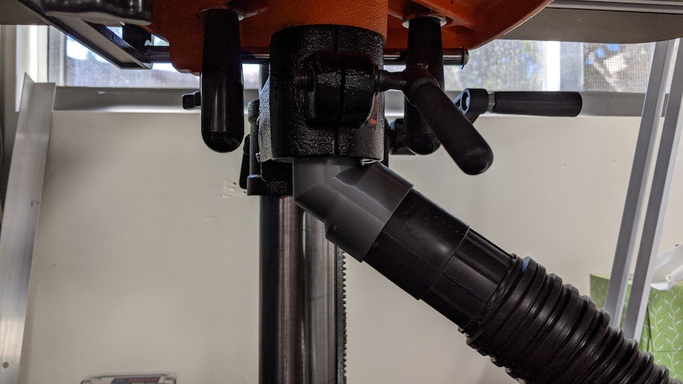

Shop Vac Adapters
==================

Adapters to fit the hose of Rigid shop vacuum to a few tools and another to fit drill press.

## Dewalt DWS780 Saw
This comes with a dust collection bag that sits at the end of tube behind the saw. It doesn't collect very much dust, so I thought I would hook a shop vac to it. The design is really simple, just adapting two different inside diameters.

## WEN 4214 Drill Press
It doesn't have a dust collection point, so I just used hollow stem of the table. I order to get the some clearance for the hose when attached, I added an 55deg elbow. Surprisingly, this prints just fine without supports on a Prusa MK3S with PLA.

This was my first time using the sweep tool in Fusion 360, I used it to make the 55deg elbow.

